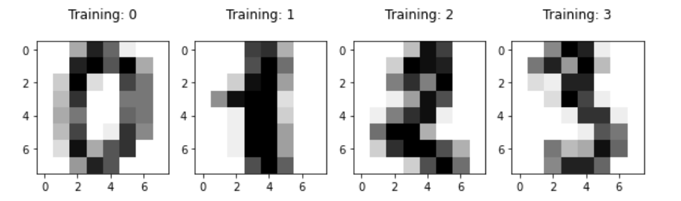
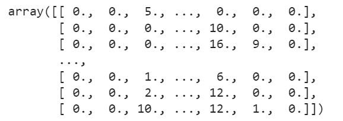

# **Artificial Intelligence**

## **Data Analysis using Scikit-learn**
 

### **ABSTRACT**
This report evaluates different learning algorithms in data analysis from the **Scikit-learn** library. The aim
of this assignment includes predicting a numeric value, and then reading and interpreting the image of a
handwritten digit. The machine learning models will be given the MNIST handwritten digit database,
where they will be trained to predict which digit it represents, from 0 to 9. The models are then evaluated
based on their accuracy, characteristics and also the limitations of each learning algorithm.

 

### **PROBLEM DEFINITION**
The MNIST dataset consists of 8x8 pixel images of handwritten digits in grayscale, such as the following
image: 

The total number of datapoints is 1797, which are embedded in a 64-dimension space. This dataset can
be classified into 10 classes (target), into their actual digits 0 to 9. Each datapoint is an 8 by 8 array, which
can be flattened into an 8 * 8 = 64-dimensional vector. Each component of the vector, or feature, is a
value between 0 and 15, describing the intensity of the pixel. The image below shows the flattened data
matrix for 0.

 

### **EXPERIMENTS**
Various learning algorithms are applied to the digit dataset for data analysis and prediction. The dataset
is divided into a training set, validation set, and test set of 6:2:2 ratio to evaluate the performance of each
model using **train_test_split()** function.
Each model is trained using **fit()** function given the training dataset, validated and tested using **predict()**
function. All functions mentioned are provided in the **sklearn** library. The validation set is used to
approximate each models’ accuracy during training, without exposing them to the testing set beforehand.
The experiment methods used are described as follows.

 

> #### **K-NEAREST NEIGHBORS (KNN)**
KNN is a type of supervised learning which predicts the class of a new data point by the majority of votes
of its k-nearest neighbors based on the similarity measure, i.e., distance. The model structure of KNN is
determined wholly from the dataset. At training phase, KNN stores the dataset and only does classification
when it receives new data. The KNN classifier is created using **KNeighborsClassifier()** function with the value of k set to an odd
number, k = 25.

 

> #### **LOGISTIC REGRESSION**
Logistic regression is a statistical model that uses a sigmoid function to calculate the probabilities for
classification problems. It has no analytical solution; a logistic classifier uses maximum likelihood
estimation (MLE) as its objective function and then optimizes the solution with gradient descent. The logistic regression model is created using **LogisticRegression()** function, with all parameters set to default.

 

> #### **SUPPORT VECTOR MACHINE (SVM)**
Support vector machine (SVM) is a supervised machine  learning algorithm which uses the kernel trick
technique to transform data into a higher dimensional space and finds an optimal boundary between
possible outputs based on these transformations. The estimator of Support Vector Classification (SVC) type is created using **svm.SVC()** function. A custom
linear kernel is defined, which is used by the SVM classifier.

 

> #### **FISHER’S DISCRIMINANT ANALYSIS (FDA)**
Fisher’s linear discriminant projects datapoints onto a line so that samples from different classes are well
separated. This can be achieved by maximizing the between-class variance and minimizing the within class
variance. To learn, FDA calculates the mean and variance for input features by class label. Predictions are
made by estimating the probability of the new data belonging to each class based on each statistical value.
The new datapoint will be assigned to the class that results in the largest probability. The FDA model is created using **LinearDiscriminantAnalysis()** function.

 

> #### **LINEAR REGRESSION**
Linear Regression is a supervised machine learning method which models a target prediction based on
independent variables. It assumes a linear relationship between inputs variables, i.e., features of
handwritten digits and output, i.e., target label. The regression classifier is created using **LinearRegression()** function.

  

> #### **NEURAL NETWORK: MULTI-LAYER PERCEPTRON (MLP)**
Multi-layer perceptron (MLP) is a feedforward neural network where the mapping between inputs and
output is non-linear. It consists of input and output layers with one or more hidden layers, formed by
many neurons stacked together. MLP is a supervised learning method; it learns a mapping from inputs to
outputs by a feedforward algorithm and backpropagation. The MLP model is created using **MLPClassifier() function**, with 1 hidden layer and 10 hidden units. The
solver parameter is set to ‘sgd’, meaning that the MLP trains using Stochastic Gradient Descent.

 

### **EXPERIMENT RESULTS**
The performance of each model is evaluated based on various performance metrics such as prediction
accuracy and prediction latency to show its effectiveness in recognizing handwritten digits from the test
dataset.

#### **PREDICTION ACCURACY**
Accuracy is defined as correct predictions / total number of datapoints. The following table shows the
accuracy of predicting labels of test data, obtained using **accuracy_score()** function, sorted from highest
to lowest.

| Model | Accuracy |   
|----------|---|
| Logistic regression       | 0.980555555555556   |
| SVM         | 0.977777777777778 | 
| Fisher’s Discriminant Analysis         | 0.963888888888889  | 
| K-Nearest Neighbors        | 0.961111111111111   |   
| Multi-layer Perceptron         | 0.911111111111111  | 
| Linear regression         | 0.522638508750540 | 

As seen in the table, the logistic regression model outperforms all the tested models with an accuracy of
98%. The models have prediction accuracy above 90%, except linear regression. Since the relationship
between the features of the MNIST dataset are not linear, the linear classifier fails to fit the complex
dataset properly. In other words, linear regression performs poorly when the data is not linearly separable.

 

#### **PREDICTION LATENCY**
Prediction latency is the elapsed time necessary to make a prediction, calculated using IPython’s %timeit
command. The following table shows the prediction time of each model, sorted from fastest to slowest.

| Model | Latency (ms) |   
|----------|---|
| Linear regression         | 0.153 | 
| Logistic regression       | 0.162   |
| Fisher’s Discriminant Analysis         | 0.165  | 
| Multi-layer Perceptron         | 0.408 | 
| SVM         | 5.480 | 
| K-Nearest Neighbors        | 34.00   |   

Regression models take the shortest time to make predictions due to their straightforward calculations.
The time complexity of MLP depends on the neural network architecture, and since this model only has 1
hidden layer, back propagation is less time-consuming. SVM does complex data transformations to
separate the datapoints, thus it takes significantly longer time than the other models, with a single
exception.

The KNN model has the highest time complexity compared to other models since it needs to calculate the
distance between data points for the whole dataset when making prediction. It requires high computing
power, especially when the data sample is large, making it the costlier than other machine learning
algorithms.

 

#### **VALIDATION DATA: COMPARISON WITH ACTUAL VALUE**
The predicted values of validation data are compared with the actual values in the following table. (Note:
due to the large dataset sample, only 10 values from the whole dataset are shown below.)
Actual values: 0 4 1 5 4 0 9 0 5 4

| Model | Predicted values |   
|----------|---|
| K-Nearest Neighbors        | 0 4 1 5 4 0 7 0 5 4   | 
| Logistic regression        | 0 4 1 5 4 0 9 0 9 4   |
| SVM         | 0 4 1 5 4 0 9 0 5 4 | 
| Fisher’s Discriminant Analysis         | 0 4 1 5 4 0 7 0 9 4  | 
| Multi-layer Perceptron         | 0 4 4 5 4 0 3 0 9 4 | 
| Linear regression          | 1.4553349 2.0478215 0.6538226 5.3014675 2.3141961 2.4847562 8.8019568 1.7684730 6.8892145 3.0984236| 

From the previous table, the difference between the actual value and predicted value of the validation
dataset can be observed. The result aligns with each model’s prediction accuracy, with the majority having
very similar predicted values and linear classifier having the lowest predictive accuracy. Unlike other
classifiers, the linear classifier returns floating point numbers as output prediction values, again proving it
being an unfitting classification algorithm for this problem.

 

### **CONCLUSION**
In this experiment, different machine learning algorithms are implemented using Scikit-learn library to
perform handwritten digit recognition. The MNIST dataset is divided into training data, validation data,
and test data for all models. It is important to not test on the same data given to train, because it will not
reflect what the classifier has managed to learn. The models are trained with the training data and
validated with validation data, before given the testing data to make predictions.

Result analysis shows that each model performs differently in making predictions, due to the varying
characteristics of the model. The performance of a model on the dataset depends on whether the features
of the dataset satisfy the assumptions of said machine learning algorithm. Given the large sample size of
the MNIST digit dataset, it can be observed that most models utilized during this experiment are highly
capable of recognizing handwritten digits, with one exception being linear regression.